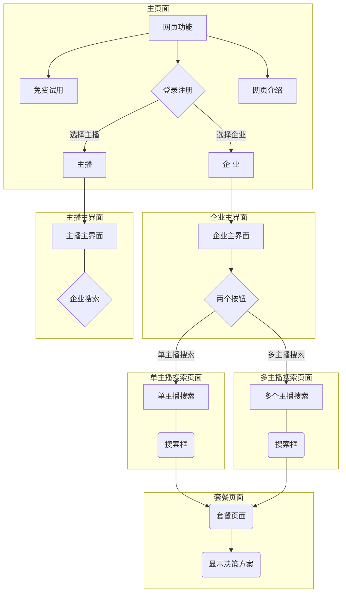
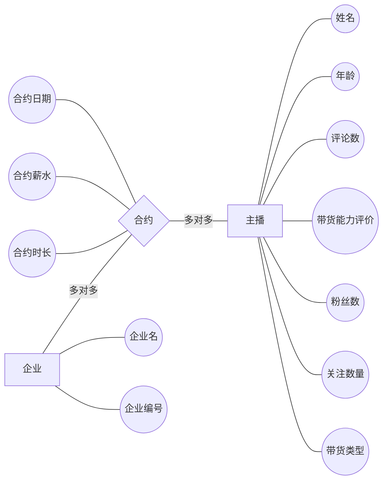

# 开发环境

## github账号

+ 每次commit之前要把Front_end下面的node_modules删除(体积太大)

+ 每个人有一个以名字首字母小写命名的分支

```shell
git clone             #


```


## 项目结构

前端：

```sh
npm install
npm run serve
```

后端：

flask框架


# 网站介绍




## 主页面

+ 介绍

+ + 免费试用
  + 登录\注册

  

## 企业主界面

+ 主播搜索
  + 方案一：热门搜索关键词
  + 方案二：固定的类别

+ 右上角功能 
  + 升级续费
  + 我的权限
  + 我的收藏
  + 个人消息
  + 退出

## 主播主界面

### 相关功能

**提供一个搜索框**

+ 主播主动可以联系企业进行合作

+ 右侧栏

  + 付费服务

    + 向平台申请做广告

  + 我的权限

    + 自主设计广告权限

  + 我的收藏

  + 个人消息

  + 退出

    


## 单主播搜索页面

### 相关功能

+ 排序

  + 综合排序

  + 流量排序

  + 薪酬排序

  + 信用排序

+ 筛选条件
  + 合作薪酬

  + 直播时段

  + 直播平台

  + 流量口

## 多主播搜索页面

### 相关功能

+ 筛选条件
  + 预算选择
  + 产品类型选择
  + 期望销售数量

## 决策方案提供页面

+ 主播数据

+ 方案分析

+ 粉丝画像

+ 套餐对比

  


# 数据库设计

## 主播数据




# 数据抓取

# 数学建模

